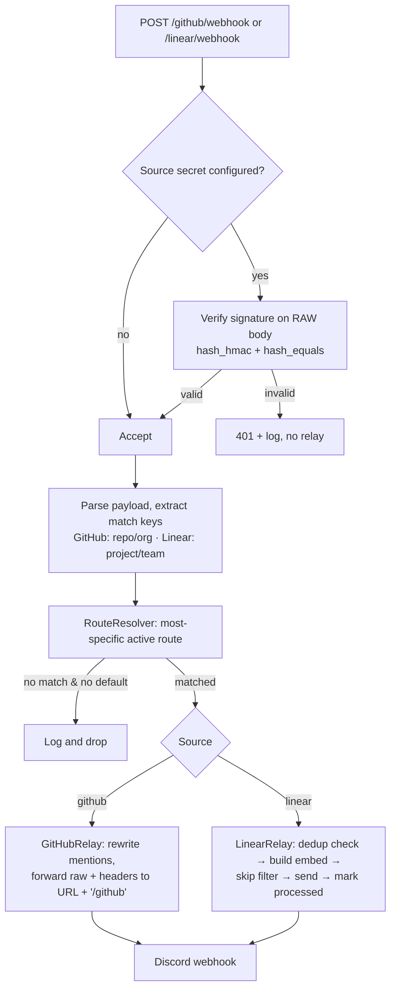

# feat: Rebuild GitHub/Linear → Discord Relay on Laravel 13 + Inertia React

## Summary

Replace the current Laravel 10 config-file-driven webhook relay with a fresh Laravel 13
application that keeps the relay behavior identical but moves all configuration into a
database managed through a single-admin React + Inertia GUI. The GUI manages Discord member
mappings, destination Discord webhooks with most-specific-match routing
(GitHub `repo → org → global`, Linear `project → team → global`), and optional per-source
inbound signature verification. Existing inbound endpoints and their external URLs are
preserved so configured GitHub/Linear webhooks keep delivering unchanged.

Built from `docs/brainstorms/2026-06-18-github-discord-relay-rebuild-requirements.md`.

---

## Problem Frame

The current app (two controllers, `config/user_mapping.php`, `DISCORD_WEBHOOK_URL_1/2` env)
requires a code edit + redeploy to change who-maps-to-whom or where events are routed, supports
exactly one destination per source, and performs no inbound authentication — anyone who knows
a webhook URL can post forged events into Discord. The rebuild makes routing and mappings
data-driven and operator-editable, adds optional signature verification, and modernizes the
stack, without changing the externally observable relay output for existing traffic.

---

## Scope Boundaries

### In scope
- Fresh Laravel 13 scaffold (official React starter kit) replacing the Laravel 10 skeleton in
  this repo, preserving `.git`, `docs/`, `README.md`.
- Single seeded admin login (no registration/roles).
- DB-backed members, member identities, webhook routes, and settings.
- Faithful port of GitHub and Linear relay behavior (see U6, U7).
- Most-specific-match destination routing with a global default per source.
- Optional per-source signature verification (enforce when a secret is configured).
- Admin GUI: Members, Routes, Settings, Login.
- Seeder migrating current mapping data and the two destination webhooks.

### Deferred to Follow-Up Work
- Delivery/audit log and retry UI (origin: explicitly deferred — relay writes to the
  `webhooks` log channel only).
- Replay-protection timestamp window for Linear (`webhookTimestamp`) — recommended by Linear
  docs; not in origin scope. Noted in U8 as a low-cost future hardening.

### Outside this iteration (origin non-goals)
- Multi-user accounts, roles, invitations.
- Event-type-based routing or per-destination event filtering.
- Sources other than GitHub and Linear.

---

## Key Technical Decisions

- **Target the current starter-kit stack, not the spec's assumed versions.** The official
  Laravel React starter kit now ships **Inertia 3**, **Laravel Fortify**, React 19,
  Tailwind 4, Vite 8 on Laravel `^13.7`. The origin doc assumed Inertia 2 / Breeze. The
  `useForm` call-site API is unchanged, so CRUD plans hold; auth trimming becomes a Fortify
  config flag rather than controller deletion.
- **Webhook routes live outside the `web` middleware group.** Register them in a dedicated
  `routes/webhooks.php` wired with no CSRF/session middleware (Laravel 13 renamed CSRF to
  `preventRequestForgery`; the docs recommend keeping machine-to-machine routes out of `web`
  entirely). Same external paths (`/github/webhook`, `/linear/webhook`) as today.
- **Most-specific-match resolution in a dedicated `RouteResolver` service**, not in
  controllers. GitHub precedence `repo → org → global`; Linear `project → team → global`.
  No match and no global default → log and drop (origin behavior on miss).
- **Signature verification uses the raw request body.** `$request->getContent()` +
  `hash_hmac('sha256', …)` + `hash_equals()`. GitHub `X-Hub-Signature-256` is prefixed
  `sha256=`; Linear `Linear-Signature` is unprefixed hex. Decode JSON only after verifying.
  Enforce only when the source's secret is configured; otherwise accept (origin decision).
  Reject with **401** (origin success criterion; `403` considered and rejected to match spec).
- **Secrets stored with Eloquent `encrypted` casts** in a `TEXT` column (ciphertext is
  variable-length and unqueryable — fine for signing secrets).
- **Linear match values key off stable Linear IDs**, not human names, for rename-robustness
  (origin outstanding question; default chosen). Store a display label alongside for the GUI.
- **GitHub destination URL keeps the `/github` suffix; Linear uses the URL as-is** — preserved
  exactly from current behavior.

---

## High-Level Technical Design

### Inbound relay flow



### Data model

```mermaid
erDiagram
    users ||--o{ NONE : "single admin (Fortify)"
    members ||--o{ member_identities : has
    members {
        id pk
        string name
        string discord_user_id "snowflake"
    }
    member_identities {
        id pk
        fk member_id
        enum source "github|linear"
        string external_id "gh username or linear uuid"
    }
    webhook_routes {
        id pk
        enum source "github|linear"
        enum scope "repo|org|project|team|global"
        string match_value "nullable for global"
        text discord_webhook_url
        string label
        bool is_active
    }
    settings {
        id pk
        string key "unique"
        text value "encrypted"
    }
```

---

## Output Structure

New/changed application code (within the scaffolded Laravel 13 app):

```
app/
  Http/Controllers/
    GitHubWebhookController.php        # thin: verify → resolve → relay
    LinearWebhookController.php        # thin: dedup → resolve → relay
    Admin/MemberController.php
    Admin/WebhookRouteController.php
    Admin/SettingController.php
  Http/Middleware/
    VerifyWebhookSignature.php         # optional, source-aware
  Services/Relay/
    RouteResolver.php
    DiscordClient.php
    GitHubRelay.php
    LinearRelay.php
    MentionMapper.php
  Models/
    Member.php
    MemberIdentity.php
    WebhookRoute.php
    Setting.php
database/
  migrations/*_create_members_table.php (+ identities, routes, settings)
  seeders/{DatabaseSeeder,AdminSeeder,RelayMappingSeeder}.php
routes/
  webhooks.php                        # no-CSRF inbound endpoints
  web.php                             # admin (auth group)
resources/js/pages/
  members/{index,create,edit}.tsx
  routes/{index,create,edit}.tsx
  settings/relay.tsx
tests/Feature/ ... tests/Unit/ ...
```

The per-unit **Files** lists are authoritative; this tree is the expected shape.

---

## Implementation Units

### U1. Scaffold Laravel 13 + React starter kit in place

**Goal:** Replace the Laravel 10 skeleton with a fresh Laravel 13 React-starter-kit app in this
repo while preserving `.git`, `docs/`, `README.md`, `.editorconfig`, and the brainstorm/plan docs.

**Requirements:** "Fresh Laravel 13 scaffold using the official React starter kit."

**Dependencies:** none.

**Files:** repo root (composer.json, package.json, bootstrap/app.php, vite.config.ts, etc.),
`resources/js/**`, `app/**` (replaces legacy controllers/Kernel), `docs/**` (preserved),
`README.md` (preserved).

**Approach:** `laravel new` requires an empty directory, so scaffold into a temp dir
(React starter kit, skip WorkOS), then move generated files into the repo over the legacy
skeleton — deleting `app/Http/Kernel.php`, `app/Console/Kernel.php`, `app/Exceptions/Handler.php`,
`app/Http/Middleware/*` (legacy), the old `config/*` defaults, and the two legacy controllers.
Keep `docs/`, `.git/`, `README.md`, `.editorconfig`. Confirm `php artisan` boots, `npm run build`
is green, and the default Fortify login renders. Preserve `DB_CONNECTION=sqlite` default.

**Patterns to follow:** stock starter-kit layout (`resources/js/pages`, `layouts/app-layout.tsx`).

**Test scenarios:** `Test expectation: none — scaffolding`. Verification is a green build + boot.

**Verification:** `php artisan about` reports Laravel 13.x; `npm run build` succeeds; visiting `/`
redirects to the Fortify login; `git status` shows `docs/`, `README.md`, `.git` intact.

---

### U2. Trim auth to a single seeded admin

**Goal:** One admin account, login only — no registration, roles, or (optionally) reset/verify.

**Requirements:** "Single seeded admin account … no registration, roles, or password-reset UI."

**Dependencies:** U1.

**Files:** `config/fortify.php`, `resources/js/pages/auth/register.tsx` (delete),
`resources/js/pages/auth/login.tsx` (remove signup link/Wayfinder ref),
`database/seeders/AdminSeeder.php`, `database/seeders/DatabaseSeeder.php`,
`app/Console/Commands/SetAdminPassword.php`, `.env.example`,
`tests/Feature/Auth/AdminLoginTest.php`.

**Approach:** Remove `Features::registration()` (and `resetPasswords`/`emailVerification`/
`twoFactorAuthentication` for a bare login) from `config/fortify.php`. Delete the register page
and any `<Link>`/Wayfinder references to the disabled routes so the Vite build stays green.
Seed the admin idempotently via `User::updateOrCreate` keyed on `ADMIN_EMAIL`, password from
`ADMIN_PASSWORD`, `email_verified_at => now()`. Add `app:set-admin-password` artisan command
using `$this->secret()` for production resets (avoids `env()` under cached config). Add
`ADMIN_EMAIL`/`ADMIN_PASSWORD` to `.env.example`.

**Patterns to follow:** Fortify `config/fortify.php` feature flags; `Actions/Fortify/*`.

**Test scenarios:**
- Covers SC ("operator can manage via GUI"). Seeded admin can log in with env credentials and
  reach a protected admin page.
- Visiting the registration route returns 404/redirect (feature disabled).
- An unauthenticated request to an admin route redirects to login.
- `app:set-admin-password` updates the existing admin's password (re-login works with the new
  one, fails with the old).
- Re-running the seeder is idempotent (no duplicate admin).

**Verification:** Login works with seeded creds; no registration route; `npm run build` green.

---

### U3. Database schema and Eloquent models

**Goal:** Persist members, their source identities, webhook routes, and settings.

**Requirements:** Data model section of origin (members, member_identities, webhook_routes,
settings).

**Dependencies:** U1.

**Files:** `database/migrations/*_create_members_table.php`,
`*_create_member_identities_table.php`, `*_create_webhook_routes_table.php`,
`*_create_settings_table.php`, `app/Models/Member.php`, `app/Models/MemberIdentity.php`,
`app/Models/WebhookRoute.php`, `app/Models/Setting.php`,
`tests/Unit/Models/MemberIdentityTest.php`, `tests/Unit/Models/SettingTest.php`.

**Approach:**
- `members`: `name`, `discord_user_id` (string snowflake).
- `member_identities`: `member_id` FK (cascade), `source` enum(`github`,`linear`), `external_id`
  string; unique composite `(source, external_id)`. A member may have many (handles the two
  GitHub usernames → one person case in current data).
- `webhook_routes`: `source` enum, `scope` enum(`repo`,`org`,`project`,`team`,`global`),
  `match_value` (nullable, used by non-global scopes), `discord_webhook_url` (text), `label`,
  `is_active` (default true). Partial uniqueness on `(source, scope, match_value)` enforced in
  app validation (SQLite nullable-unique caveat) — at most one global route per source.
- `settings`: `key` (unique), `value` (`TEXT`, `encrypted` cast). Used for per-source signing
  secrets (`github_webhook_secret`, `linear_webhook_secret`) and the Linear skip-filter config.
- `Member hasMany MemberIdentity`; helper scopes `githubIdentities()`, `linearIdentities()`.
- `Setting` cast `value => 'encrypted'`; a typed accessor helper (`Setting::get($key)`).

**Patterns to follow:** Laravel migration + model conventions; `protected function casts()`.

**Test scenarios:**
- A member with two GitHub identities and one Linear identity persists and reads back.
- Unique `(source, external_id)` rejects a duplicate identity.
- Deleting a member cascades its identities.
- A `Setting` value round-trips through encryption (stored ciphertext ≠ plaintext; read = plaintext).
- `WebhookRoute` defaults `is_active` to true.

**Verification:** `php artisan migrate:fresh` succeeds; model tests pass.

---

### U4. Seed existing mappings and default routes

**Goal:** Carry current `config/user_mapping.php` data and the two destination webhooks into the DB.

**Requirements:** Migration/Seeding section of origin.

**Dependencies:** U3.

**Files:** `database/seeders/RelayMappingSeeder.php`, `database/seeders/DatabaseSeeder.php`,
`tests/Feature/Seeding/RelayMappingSeederTest.php`.

**Approach:** Seed 12 GitHub identities and 7 Linear identities from the current map, grouping
the two GitHub usernames that share Discord ID `1225685531141079100` under one member
(`mdrabbi97324`, `itsmdrabbi`). Derive `members` from the distinct Discord IDs; attach
identities. Strip the `<@…>` wrapper into `discord_user_id` (store the raw snowflake; relays
re-wrap as `<@id>`). Seed two `global` `webhook_routes` from `DISCORD_WEBHOOK_URL_1` (github)
and `DISCORD_WEBHOOK_URL_2` (linear) when those env vars are present. Idempotent via
`updateOrCreate`.

**Patterns to follow:** seeder `updateOrCreate`; origin verbatim map (see origin doc).

**Test scenarios:**
- After seeding, GitHub identity count = 12 across the correct number of distinct members; the two
  shared usernames resolve to the same member.
- Linear identity count = 7; UUIDs map to the expected Discord IDs.
- Two global routes exist (one per source) when env URLs are set; absent env → no route seeded.
- Re-running the seeder does not duplicate members, identities, or routes.

**Verification:** `php artisan db:seed` populates expected rows; seeder test passes.

---

### U5. RouteResolver service (most-specific-match)

**Goal:** Given a source and extracted match keys, return the destination route or null.

**Requirements:** Routing Model section of origin.

**Dependencies:** U3.

**Files:** `app/Services/Relay/RouteResolver.php`,
`app/Services/Relay/MatchKeys.php` (small value object), `tests/Unit/Relay/RouteResolverTest.php`.

**Approach:** For GitHub, attempt active routes in order `repo` (`owner/repo`) → `org`
(`owner`) → `global`. For Linear, `project` (id) → `team` (id) → `global`. Return the first
active match; null when nothing matches and no global default exists. Pure, DB-reads-only, no
side effects — easy to unit test with seeded routes.

**Technical design (directional, not spec):**
```
resolve(source, keys):
  for scope in precedence[source]:        # e.g. github: [repo, org, global]
    value = keys[scope]                   # null for global
    route = WebhookRoute.activeMatch(source, scope, value)
    if route: return route
  return null
```

**Patterns to follow:** service class resolved via container; query scopes on `WebhookRoute`.

**Test scenarios:**
- GitHub: a repo-scoped route beats an org-scoped and global route for a matching repo.
- GitHub: repo with no repo route but matching org → org route; unknown org → global default.
- GitHub: no match and no global → null.
- Linear: project route beats team and global; team fallback when no project route; global last.
- Inactive (`is_active=false`) routes are skipped even on exact match.
- Most-specific selection ignores routes of the other source.

**Verification:** Resolver unit tests cover every precedence rung per source.

---

### U6. GitHub relay service (faithful port)

**Goal:** Reproduce current GitHub relay behavior against a resolved destination.

**Requirements:** "GitHub relay" behavior-to-preserve section of origin.

**Dependencies:** U3, U5.

**Files:** `app/Services/Relay/GitHubRelay.php`, `app/Services/Relay/DiscordClient.php`,
`app/Services/Relay/MentionMapper.php`, `tests/Feature/Relay/GitHubRelayTest.php`.

**Execution note:** Characterization-first — assert byte-for-byte parity with the documented
current behavior before refactoring internals.

**Approach:** Port `modifyPayload` exactly: recursive `array_walk_recursive` over the decoded
payload, string nodes only, cumulative `str_replace("@$username", "<@$discordId>", …)` for every
GitHub identity (substring replace, not word-boundary — preserved deliberately). Build the
mention map from `member_identities` where `source=github` via `MentionMapper`. Forward the
(modified) raw payload to `route.discord_webhook_url . '/github'` with the same 8 re-proxied
headers (`Accept`, `Content-Type`, `User-Agent`, `X-GitHub-Delivery`, `X-GitHub-Event`,
`X-GitHub-Hook-ID`, `X-GitHub-Hook-Installation-Target-ID`,
`X-GitHub-Hook-Installation-Target-Type`). Use Guzzle with a **2.0s timeout**; on failure
`Log::error` to the default channel (matching current behavior) and swallow. `DiscordClient`
wraps the HTTP POST so it can be faked in tests.

**Patterns to follow:** current `GitHubWebhookController` (port, see origin); `Http::fake()` /
faked `DiscordClient`.

**Test scenarios:**
- Covers SC ("identical formatting after rebuild"). A payload containing `@phpfour` is rewritten
  to `<@538057585698537506>` everywhere it appears (nested objects/arrays included).
- A username substring inside unrelated text is replaced (documents the current substring
  behavior, not word-boundary) — guards against silent behavior drift.
- Non-string nodes (ints, bools, null) are untouched.
- The destination URL has `/github` appended; the 8 headers are forwarded with inbound values;
  an absent inbound header forwards as null.
- Discord failure (timeout/5xx) is logged and does not throw; handler still returns success.
- A user with no mapping is left as literal `@name`.

**Verification:** Relay test asserts outbound URL, headers, and rewritten body via a faked client.

---

### U7. Linear relay service (faithful port)

**Goal:** Reproduce the Linear embed transform, dedup, and skip filter against a resolved destination.

**Requirements:** "Linear relay" behavior-to-preserve section of origin.

**Dependencies:** U3, U5.

**Files:** `app/Services/Relay/LinearRelay.php`, `tests/Feature/Relay/LinearRelayTest.php`,
`tests/Unit/Relay/LinearEmbedTest.php`.

**Execution note:** Characterization-first against documented current output.

**Approach:** Port the full pipeline: `md5(type|action|data.id|createdAt)` dedup key, cache
`processed_event:{id}` with **24h TTL**, early-return 200 on a hit. Build the embed exactly —
`addProjectField` always first; per-type handlers for `Issue`/`Comment`/`Project`/`ProjectUpdate`;
default "Unhandled event type"; color-by-action map (`create` green `0x4CAF50`, `update` blue
`0x2196F3`, `remove` red `0xF44336`, default grey `0x9E9E9E`); priority emoji map (0–4 + `❓`);
`truncateText` at 1024 (byte-based, preserved); footer "Sent via Linear Webhook". Actor/assignee
Discord tags from `member_identities` where `source=linear`. Skip filter (`issue→update`, sourced
from `settings`) runs **inside send, after transform + logging**, and does **not** mark the event
processed — preserved exactly. Send to `route.discord_webhook_url` **as-is** (no suffix) via the
HTTP client; verbose logging to the `webhooks` channel; `markProcessed` only after a send attempt.

**Patterns to follow:** current `LinearWebhookController` (port, see origin); `webhooks` log channel.

**Test scenarios:**
- Covers SC ("identical formatting"). An `Issue/create` payload yields the expected title,
  green color, Project/Status/Assignee/Priority fields, and content sentence with mapped actor
  mention.
- `Comment`, `Project`, `ProjectUpdate` each produce their documented embed shape; unknown type →
  "Unhandled event type" description.
- Priority emoji and action color maps return documented values per input; `truncateText` cuts at
  1024 with `…`.
- Dedup: a repeated `(type|action|data.id|createdAt)` within 24h returns the "already processed"
  200 and does not re-send.
- Skip filter: `issue/update` is transformed and logged but not sent, and is **not** marked
  processed (a later non-skipped same-key event can still send).
- Unmapped Linear UUID renders `Unknown User`.

**Verification:** Embed unit tests + relay feature test assert structure, dedup, and skip behavior.

---

### U8. Inbound endpoints + optional signature verification

**Goal:** Wire the two CSRF-free endpoints to verification + resolver + relay services.

**Requirements:** Inbound endpoints + Security sections of origin; SC3.

**Dependencies:** U5, U6, U7.

**Files:** `routes/webhooks.php`, `bootstrap/app.php` (route registration),
`app/Http/Controllers/GitHubWebhookController.php`,
`app/Http/Controllers/LinearWebhookController.php`,
`app/Http/Middleware/VerifyWebhookSignature.php`,
`tests/Feature/Webhooks/GitHubWebhookTest.php`,
`tests/Feature/Webhooks/LinearWebhookTest.php`,
`tests/Feature/Webhooks/SignatureVerificationTest.php`.

**Approach:** Register `/github/webhook` and `/linear/webhook` (same external paths as today) in
`routes/webhooks.php` with no `web` group (no CSRF/session). `VerifyWebhookSignature` reads the
per-source secret from `settings`; if present, verify on the **raw body** (`$request->getContent()`)
with `hash_hmac('sha256', …)` + `hash_equals()` — GitHub `X-Hub-Signature-256` prefixed `sha256=`,
Linear `Linear-Signature` unprefixed — and `abort(401)` on mismatch; if no secret, pass through
(origin decision). Controllers stay thin: extract match keys (GitHub repo/org from
`repository.full_name`/`organization.login` or owner; Linear project/team ids from payload),
resolve the route, drop+log on no match, else delegate to the relay service. Decode JSON only
after verification.

**Technical design (directional):**
```
github keys: repo = payload.repository.full_name; org = payload.organization.login ?? owner(repo)
linear keys: project = data.project.id; team = data.team.id (per event shape)
```

**Test scenarios:**
- Covers SC3. With a configured GitHub secret, a request signed with the wrong secret → 401, no
  relay; correctly signed → relayed.
- Covers SC3. With no GitHub secret configured, an unsigned request is accepted (current behavior).
- Linear: valid `Linear-Signature` accepted; invalid → 401 when secret configured.
- Endpoints are reachable without a CSRF token (outside `web`).
- GitHub request to a repo with a repo route hits that destination; falls back to org then global
  (integration with RouteResolver).
- No matching route and no global default → 2xx response, nothing sent, drop logged.
- Raw-body integrity: signature is computed against unmodified bytes (a re-encoded body would fail)
  — guards the raw-body gotcha.

**Verification:** Webhook feature tests cover signed/unsigned/invalid paths and routing integration
end to end.

---

### U9. Members admin GUI

**Goal:** CRUD for members and their GitHub/Linear identities.

**Requirements:** Admin GUI → Members.

**Dependencies:** U2, U3.

**Files:** `app/Http/Controllers/Admin/MemberController.php`, `routes/web.php`,
`resources/js/pages/members/index.tsx`, `create.tsx`, `edit.tsx`,
`app/Http/Requests/MemberRequest.php`, `tests/Feature/Admin/MemberCrudTest.php`.

**Approach:** `Route::resource('members', …)` in the `auth` group. Inertia pages list members with
their Discord ID and identity chips; create/edit forms (Inertia `useForm`) capture name, Discord
ID, and a repeatable set of identities (`source` + `external_id`). Server validation via
`MemberRequest` (Discord ID format; unique `(source, external_id)`); errors surface through
Inertia's `errors`.

**Patterns to follow:** starter-kit `resources/js/pages/*` + `useForm`; `Route::resource`.

**Test scenarios:**
- Covers SC. An authed admin creates a member with a Discord ID + a GitHub identity + a Linear
  identity; it persists and appears in the index.
- Adding a duplicate `(source, external_id)` shows a validation error, no write.
- Editing a member adds/removes identities correctly.
- Deleting a member removes it and its identities.
- All member routes require auth (guest → redirect).

**Verification:** CRUD feature test green; pages render under `/members`.

---

### U10. Routes + Settings admin GUI

**Goal:** CRUD for webhook routes (grouped by source) and a settings screen for signing secrets +
the Linear skip filter.

**Requirements:** Admin GUI → Routes, Settings.

**Dependencies:** U2, U3, U5.

**Files:** `app/Http/Controllers/Admin/WebhookRouteController.php`,
`app/Http/Controllers/Admin/SettingController.php`, `routes/web.php`,
`resources/js/pages/routes/index.tsx`, `create.tsx`, `edit.tsx`,
`resources/js/pages/settings/relay.tsx`, `app/Http/Requests/WebhookRouteRequest.php`,
`tests/Feature/Admin/WebhookRouteCrudTest.php`, `tests/Feature/Admin/RelaySettingsTest.php`.

**Approach:** `Route::resource('routes', …)` in the `auth` group; index groups by source and shows
scope, match value, destination, and an active toggle. Create/edit form picks source → scope →
match value (hidden for `global`) → destination URL → label. `WebhookRouteRequest` enforces valid
scope-for-source and at-most-one global per source. Settings screen edits
`github_webhook_secret` / `linear_webhook_secret` (write-only, masked) and the Linear skip-filter
list, persisted to `settings` (encrypted). Saving a blank secret clears it (disables enforcement).

**Patterns to follow:** same Inertia CRUD shape as U9; encrypted `Setting` accessor from U3.

**Test scenarios:**
- Covers SC. An admin creates a GitHub `repo` route to a destination URL; it appears grouped under
  GitHub and is used by the resolver (integration: a subsequent webhook hits it).
- Creating a second `global` route for the same source is rejected.
- A scope invalid for the source (e.g. `team` on GitHub) is rejected.
- Toggling `is_active` off removes the route from resolution.
- Setting a GitHub secret enables enforcement (a later unsigned request → 401); clearing it
  disables enforcement.
- Secrets are stored encrypted and never sent back to the client in plaintext.
- All route/settings pages require auth.

**Verification:** Route + settings feature tests green; resolver picks up GUI-created routes;
enforcement toggles with the saved secret.

---

## System-Wide Impact

- **Operators:** routing and mappings become self-service; no redeploy to onboard a teammate or
  route a new repo/org/team.
- **External senders (GitHub/Linear):** unaffected — same endpoint URLs and output; newly able to
  (optionally) sign requests.
- **Deployment:** adds a Node/Vite build step and a DB with migrations + seeders; `APP_KEY` becomes
  load-bearing for stored secrets (document key-rotation caution).

---

## Risks & Mitigations

- **Behavioral drift from the current relay.** Mitigation: U6/U7 are characterization-first with
  parity tests against the documented current output before any refactor.
- **`laravel new` over a non-empty repo.** Mitigation: scaffold in a temp dir, move files in,
  explicitly preserve `.git`/`docs`/`README` (U1 verification checks them).
- **Raw-body signature mistakes** (hashing re-encoded JSON). Mitigation: U8 verifies on
  `$request->getContent()` and a dedicated test fails a re-encoded body.
- **`APP_KEY` rotation invalidating stored secrets.** Mitigation: document `APP_PREVIOUS_KEYS`
  graceful rotation; secrets are re-enterable via the GUI as a fallback.
- **Wayfinder build breakage** after deleting auth pages. Mitigation: remove disabled-route
  references alongside page deletion (U2); `npm run build` is a verification gate.

---

## Dependencies / Prerequisites

- PHP 8.4, Composer 2.9 (verified locally: 8.4.21 / 2.9.5), Node + npm for Vite 8.
- `laravel/installer` for `laravel new` with the React starter kit.
- Discord webhook URLs and (optionally) GitHub/Linear signing secrets for live verification.

---

## Test Strategy

- **Unit:** `RouteResolver` precedence, `MentionMapper`, Linear embed builders, `Setting` encryption.
- **Feature:** admin auth, member/route/settings CRUD, seeder correctness, GitHub + Linear relay
  parity, signature enforce-vs-skip, end-to-end routing.
- Run via `php artisan test` (`--filter`, `--testsuite`), Pint clean (`./vendor/bin/pint`).
- Per AGENTS.md: fast/isolated tests in `tests/Unit`, HTTP/flow in `tests/Feature`.

---

## Sources & Research

- Origin requirements: `docs/brainstorms/2026-06-18-github-discord-relay-rebuild-requirements.md`.
- Current behavior inventory: faithful port details for U6/U7 derived from the existing
  `GitHubWebhookController` / `LinearWebhookController` / `config/user_mapping.php`.
- Laravel 13 starter kit (Inertia 3, Fortify, React 19, Tailwind 4, Vite 8), CSRF
  `preventRequestForgery` / out-of-`web` webhook routing, encrypted casts, GitHub/Linear
  signature verification on raw body — Laravel 13.x, Inertia, GitHub, and Linear official docs
  (load-bearing: shaped the stack KTDs, CSRF/routing decision, and U8 verification approach).
